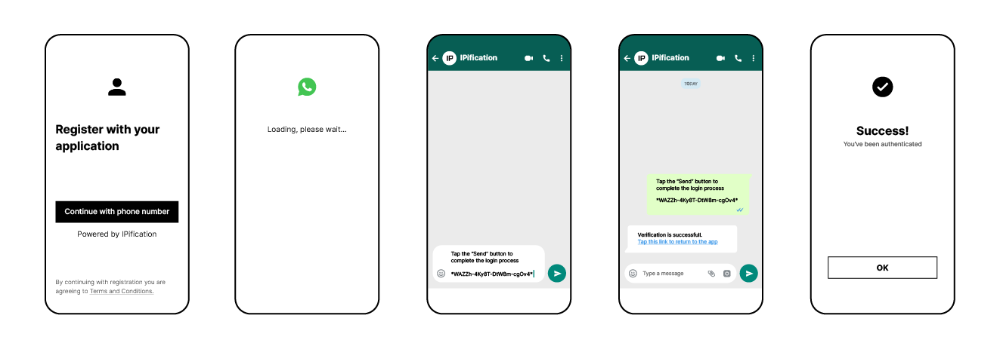
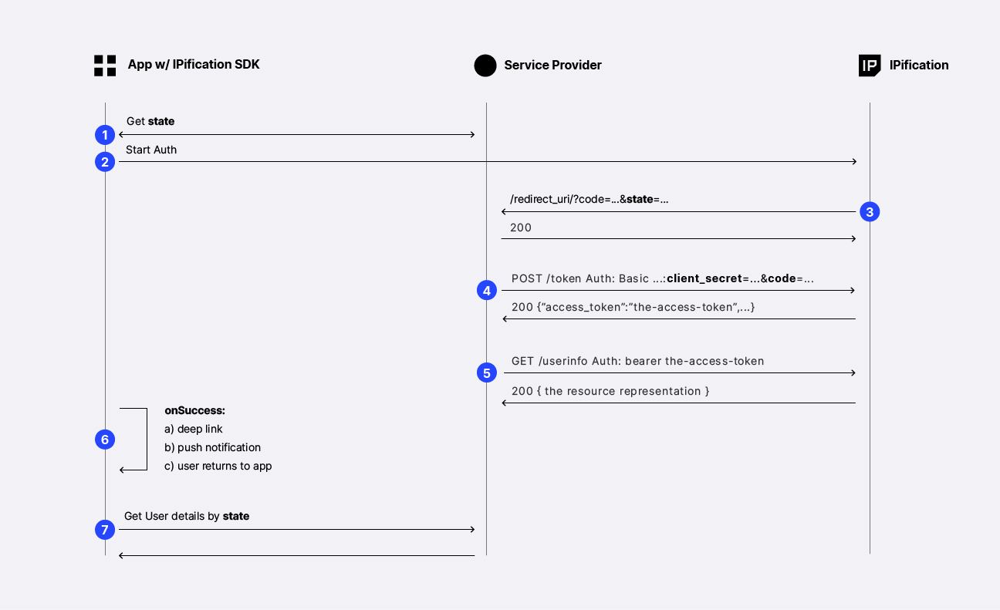
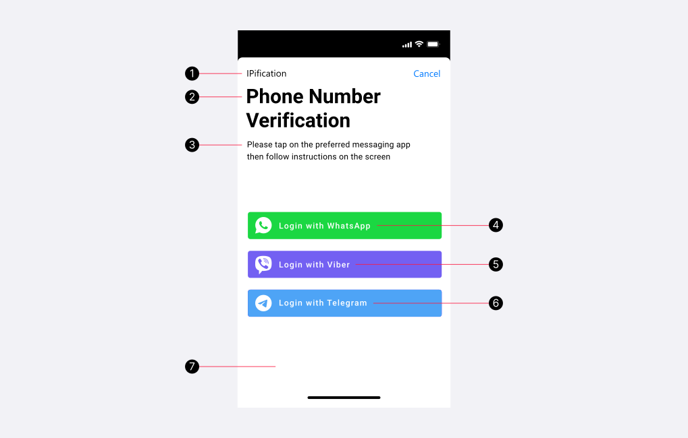

# iOS IM Authentication

This document describes the auto mode of IM Authentication.<br>
There are 2 options for IM : `IM Login` (Quick IM Authentication) and `Phone Number Verification` with IM:

**1.[IM Login](#quick-im-authentication)**

When using IM apps for the authentication IPification can provide resolved phone number. With this option, clients can significantly increase the security and user experience of their mobile/web apps, also improving user acquisition, engagement, and retention rates.
For quick IM auth, the scope value should be `scope=openid ip:phone` and `login_hint` is not required.


**2.[Phone Number Verification](#im-phone-number-authentication)**

IM apps can be used to perform phone number verification by adding `scope` = `ip:phone_verify` and providing `login_hint`


# How It Works?

1. Contact IPification to obtain the credentials (client_id and client_secret) and SDK
2. Add IPification SDK to your app
3. Configure and start IPification SDK
4. Handle callback from IPification side and perform token exchange in order to get user details

This is a flow diagram:



1. App should obtain unique `state` parameter from app backend service. This parameter will be used as session identifier between IPification and client app (step 3) and also app will use this param to query app backend service for the user details (step 7).
2. App initiate Auth via SDK function call `startAuthentication()`
3. After successful Authentication IPification will do the callback on predefined `redirect_uri` with `code` and `state` params. Client backend service should extract code since it will be used for the next step. It is important to respond with HTTP 200 on this callback.
4. Client backend service should use `code` param to retrieve Access Token - process called Token Exchange. <a href="#/auth/latest/?id=token-exchange" target="_blank">Token Exchange process</a> is a standard OIDC call on /token endpoint via HTTP POST method with client credentials. 
Response will contain `access_token` which can be <a href="https://jwt.io/" target="_blank">decoded</a> in order to retrieve user details - phone number or in case of phone number verification - result if the phone number is verified or not. Client backend service should store user details (mapped by key `state`) since it will be required for the step 7.<br>
It’s recommended to make use of common libraries for JWT decoding (list of the libs can be found here: https://openid.net/developers/jwt/). Process of decoding might present an issue for some clients, this is why the flow can be continued in order to receive user details directly from IPification server.
5. Optionally clients can make a final call to retrieve result (user details) directly instead of decoding `access_token` (<a href="#/auth/latest/?id=userinfo-call" target="_blank">user info call details</a>)
6. User has a few options to return to the app: 
   - deep link - clients can make a use of IM success messages and setup deep link as a part of the response message that will be delivered after successful Auth 
   - push notification - clients can implement <a href="#/ios/latest/?id=push-notifications" target="_blank">push notification service</a> to notify user to return to the app.
   - or simply users can return to the app manually.

   Any of them will trigger `onSuccess` registered function when app comes into focus.
7. App should implement logic to call app backend service to retrieve user details by `state` param. User details are received in step 4.


# I. Setup
## Requirements
- Xcode 11.0+
- iOS 10.3+

## Local Network Permission
Some Telco redirect hosts can resolve to a private/local network address on iOS. If your application must support that route, add `NSLocalNetworkUsageDescription` to the host application's `Info.plist` so iOS can display the Local Network permission alert when the SDK opens the connection.

```xml
<key>NSLocalNetworkUsageDescription</key>
<string>This app uses the local network only when required by your mobile operator to verify your phone number.</string>
```

The SDK cannot display this system alert directly. iOS shows it automatically on the first local-network connection attempt, and the SDK waits for the same connection to continue after the user taps Allow.

By default, the SDK waits up to 10 seconds the first time iOS may show the Local Network permission alert: 7 seconds for the initial prompt window, then another 3 seconds as a grace period. After that first prompt has been seen, the SDK checks after 1 second. If Local Network permission is still blocking the request, it waits another 3 seconds and checks again before returning `localNetworkPermissionRequired`.

When the user taps `Allow` before the SDK timeout, the SDK continues the same failed local-network request. It does not restart Check Coverage or the full authentication flow.

If Local Network permission is still required after the SDK timeout, show your own alert from `callbackFailed` and guide the user to Settings:

```swift
authorizationService.callbackFailed = { error in
    self.hideLoading()

    if error.isLocalNetworkPermissionRequired {
        let alert = UIAlertController(
            title: "Local Network Permission Required",
            message: "Enable Local Network permission in Settings, then try again.",
            preferredStyle: .alert
        )
        alert.addAction(UIAlertAction(title: "Cancel", style: .cancel))
        alert.addAction(UIAlertAction(title: "Settings", style: .default) { _ in
            if let url = URL(string: UIApplication.openSettingsURLString) {
                UIApplication.shared.open(url)
            }
        })
        self.present(alert, animated: true)
        return
    }

    // Handle other SDK errors.
}
```

## 1. Adding SDK to project

via `Swift Package Manager` or `CocoaPods` or import manually
### + Swift Package Manager
To add IPification package to your Xcode project, select `File` > `Add Packages`.<br>
You can also navigate to your target’s `General` pane, and in the `Package Dependencies` section, click the `+` button.<br>
In the search box, enter the repository URL: https://github.com/ipification/IPificationSwiftDistribution.git<br>
Choose `Version: Exact` `2.2.0`
 
<div class="video_holder">
    <iframe class="ios_adding_sdk" src="https://youtube.com/embed/W2RnsmULF_Y" title="Add SDK via Swift Package Manager | IPification" frameborder="0" allow="accelerometer" allowfullscreen></iframe>
</div>

### + CocoaPods
You can use CocoaPods to install `IPificationSDK` by adding it to your Podfile:


```Podfile 
 pod 'IPificationSDK', '2.2.0'
```
### + Import SDK manually
1. Contact IPification team then download IPification SDK from provided link
2. Right-click on your project name in the project navigator and select `Show in Finder`.
3. In the Finder’s window, create a new folder in the project’s root folder and name it `Sdk`.
4. Copy then paste the IPification SDK folder: `IPificationSDK.xcframework` into `Sdk` folder.
5. Add files into your project by selecting **Add Files to ...**.
6. In the window that appears, select `IPificationSDK.xcframework` inside `Sdk` folder, then click **Add**.
7. Open Target -> General -> Framework, Libraries then update the `IPificationSDK.xcframework` setting to **Embed & Sign**.

<div class="video_holder">
    <iframe class="ios_adding_sdk" src="https://www.youtube.com/embed/QzMs_0z02ME" title="Add SDK | IPification" frameborder="0" allow="accelerometer; autoplay; clipboard-write; encrypted-media; gyroscope; picture-in-picture" allowfullscreen></iframe>
</div><br>

## 2. Configuration Variables
During the onboarding process, IPification will provide you with SDK configuration. The SDK will read this configuration variables then use it during the authentication flow.


<!-- tabs:start -->

#### **Stage Env**

```swift
import IPificationSDK
...
func setupIPification() {
    IPConfiguration.sharedInstance.ENV = IPEnvironment.SANDBOX
    IPConfiguration.sharedInstance.CLIENT_ID = "your-stage-client-id"
    IPConfiguration.sharedInstance.REDIRECT_URI = "your-stage-redirect-uri"
}
```
#### **Production Env**

```swift
import IPificationSDK
...
func setupIPification() {
    IPConfiguration.sharedInstance.ENV = IPEnvironment.PRODUCTION
    IPConfiguration.sharedInstance.CLIENT_ID = "your-prod-client-id"
    IPConfiguration.sharedInstance.REDIRECT_URI = "your-prod-redirect-uri"
}
```
<!-- tabs:end -->


- **ENV** - SANDBOX / PRODUCTION (LIVE)

- **<a id="client-id"></a>[CLIENT_ID](#client-id)** - unique identifier of the client that is generated by IPification and provided to the client in the onboarding process.

- **<a id="redirect-uri"></a>[REDIRECT_URI](#redirect-uri)** - In the onboarding process of the client, redirect uri must be provided, this value can represent wildcard uri and will be used to validate provided `redirect_uri` in the request.

  > The format of redirect_uri should be `your-bundle-id://path/` or `https://your-domain/path`

  > `redirect_uri` schemes must be lowercase, begin with a letter and be followed by any other letter, number . - or +

- **REALM_NAME** - Keycloak realm name used in SDK endpoint paths. Default is `ipification`. Set this only when IPification provides a different realm.

```swift
IPConfiguration.sharedInstance.REALM_NAME = "your-realm"
```

<br/>

# II. IPification Authentication Flow

## 1. Import IPification SDK
```swift
import IPificationSDK
```

## 2. Enable Auto Mode

To enable auto mode, put this function in your initial function before call authentication
```swift
IPConfiguration.sharedInstance.IM_AUTO_MODE = true
IPConfiguration.sharedInstance.IM_PRIORITY_APP_LIST = ["wa"] // supports: wa, telegram, viber
```

# III. IM Authentication Flow

In case coverage is not available (Mobile Network has not yet integrated the IPification Solution - _GMiDbox™_ ), IPification provides a fallback to authentication via `Instant Messaging (IM) apps`. IPification currently supports three major IM apps: `WhatsApp`, `Viber` and `Telegram`.
With more alternative methods available, your users will be able to choose the channel they want to use and complete the verification steps on the platform they prefer.

!> No need to call **Check Coverage** since IM Authentication works on all networks.

## 1. Configure Info.plist
To open a third-party messaging app from your application, you need to add their url schemes to `LSApplicationQueriesSchemes` key in your `plist` file.
After iOS 14, to open Associated Domain URLS in a device that uses a different default browser than Safari, you also need to add https as url scheme.<br/>
Open your `Info.plist` as source code and insert the following XML snippet into the body of your file just before the final `dict` element.
```
 <key>LSApplicationQueriesSchemes</key>
 <array>  
    <string>whatsapp</string>  
    <string>telegram</string>  
    <string>viber</string>  
    <string>https</string>
 </array>
```

## 2. Universal Link
After a successful validation with a third-party messaging app, the user needs to return to the main app.
If your application has an `Associated Domain`, we can add a `Universal Link` to our message for an easy and quick redirect. Every service can set up custom success messages and include deep links to them. Setup is done via IPification Dashboard.

For setting up your Universal Link, check document: (<a href="https://developer.apple.com/ios/universal-links/" target="_blank">Universal Links</a>)
and (<a href="https://developer.apple.com/documentation/Xcode/supporting-associated-domains" target="_blank">Associated Domain</a>)

## 3. Start Authentication
IM Authentication Init is almost the same as IP Auth Init in [IPification Flow](#authentication-api). In order to enable IM fallback Auth, one extra parameter `channel` is required when the user triggers the first authentication/authorization request. Multiple channel values may be used by creating a space-delimited, case-sensitive list of channel values. All supported values are: `ip`, `wa`, `viber` or `telegram`. By sending channel values service will offer a type of Authentication to the end-user:<br>
  - `ip` - default IPification Auth - standard seamless flow described in [IPification Authentication Flow](#authentication-api)
  - `wa` - auth with WhatsApp app
  - `viber` - auth with Viber app
  - `telegram` - auth using Telegram app

> If the channel contains `ip` value, Auth will be attempted via IP Auth as a primary channel if Coverage is supported, otherwise fallback to IM will be offered. 


**Get started:**
1. Implement the callback to receive the auth result: `callbackSuccess`, `callbackFailed` and `callbackIMCanceled` :

```swift
let authorizationService = AuthorizationService()
authorizationService.callbackSuccess = { (response) -> Void in   
    // success , call your api with response.getState() to check the Auth result
}
authorizationService.callbackFailed = { (error) -> Void in
    // problem, fallback to another auth service flow
    // print("authorized failed", error.localizedDescription)
}
authorizationService.callbackIMCanceled = { () -> Void in
    // hide loading view , or something else ... 
}
```
2. Set up request parameters:
- Create instance of `AuthorizationRequest.Builder()`
- Set `scope` values. Use `setScope()` to specify what access privileges are being requested for Access Tokens. For example, use `openid ip:phone` scope for Quick IM Auth.
- Set `state` value. (required if you need to send push notification to notify auth result)

```swift
let authBuilder =  AuthorizationRequest.Builder()
authBuilder.setScope(value: "openid ip:phone")
authBuilder.setState(value: your_generated_state)
let authRequest = authBuilder.build()
```


3. Call `startAuthorization(viewController: self, authRequest)` to perform Authorization API
```swift
authorizationService.startAuthorization(viewController: self, authRequest)
```

- The response of `startAuthorization(viewController: self, authRequest)` function will be a success response or an `error`.
<br/>
4. Call your backend API with `state` to complete the Auth Flow<br/>


<br/>
<br/>


## 4. Modify IM Theme and Locale (optional)
- Locale:

<!-- tabs:start -->
```swift
IPificationLocale.sharedInstance.updateScreen(
    titleBar:"IPification", 
    title:"Phone Number Verify", 
    description:"Please tap on the preferred messaging app then follow our instruction on the screen", 
    whatsappBtnText:"Quick Login via Whatsapp", 
    viberBtnText : "Quick Login via Viber", 
    telegramBtnText : "Quick Login via Telegram", 
    cancelBtnText:"Cancel"
)
```
<!-- tabs:end -->

- Theme:

<!-- tabs:start -->
```swift
IPificationTheme.sharedInstance.updateScreen(
    toolbarTitleColor: UIColor.black, 
    cancelBtnColor: UIColor.systemBlue, 
    titleColor: UIColor.black,
    descColor: UIColor.black, 
    backgroundColor: UIColor.white
)
```
<!-- tabs:end -->

Every value can also be changed individually, so you only need to override the strings or colors you care about (the rest keep their defaults):

<!-- tabs:start -->
```swift
IPificationLocale.sharedInstance.cancelBtnText = "Back"
IPificationLocale.sharedInstance.errorMsgSessionNotFound = "This session has expired. Please try again."
IPificationLocale.sharedInstance.imErrorTitleText = "Oops"
IPificationLocale.sharedInstance.autoDesc = "Opening %@ ..."   // %@ is replaced with the app name in auto mode

IPificationTheme.sharedInstance.backgroundColor = UIColor(white: 0.97, alpha: 1)
IPificationTheme.sharedInstance.cancelBtnColor = UIColor.systemRed
```
<!-- tabs:end -->



1. **titleBar** - title bar (text, color)
2. **title** - IM page title (text, color)
3. **description** - short description (text, color)
4. **whatsappBtnText** - WhatsApp button (text)
5. **viberBtnText** - Viber button (text)
6. **telegramBtnText** - Telegram button (text)
7. **backgroundColor** - IM background color 
7. **cancelBtn** - Cancel button (text, color)

## 5. Setup Push Notifications (Optional)<a id="push-notifications"></a>
Check here for more detail (<a href="#/ios/latest/?id=push-notifications" target="_blank">Push Notifications </a>)

# IV. Scope
All supported values of scope are: `openid`, `ip:phone_verify`, `ip:mobile_id`, `ip:phone`, `ip:profile`. 

`openid` is a required scope that informs the Authorization Server that the Client is making an OpenID Connect request. One or more of the IPification custom scopes are required also.

`ip:phone` is for IM authentication.

`ip:phone_verify`, `ip:profile` are required to send `login_hint` parameter.

Check here for more detail (<a href="#/auth/latest/?id=scopes-explained" target="_blank">Scopes Explained</a>)
# V. Restrictions

IPification SDK requires a minimum iOS 10.0


# VI. Sample Project


Check out our sample App to see how it works:
```
https://github.com/ipification/ipification-ios-sdk
```
