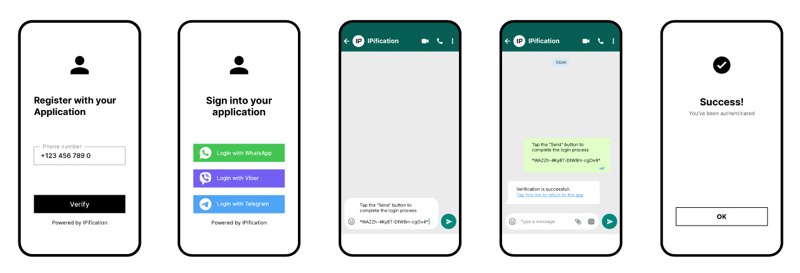

# iOS SDK

This document describes the IPification iOS SDK and its usage. The primary purpose of the SDK is to provide network-based authentication for mobile users.

At the end of the authentication flow, the client will receive information indicating whether the phone number is verified (phone_number_verified field) and/or a mobile_id field, which contains a JWT representing the unique IPification MobileID.

MobileID is a hashed (non-reversible) value derived from three network elements, combined with an additional service URI as a salt. This ensures that the end user will have a unique MobileID for each different service they access.


Before initiating authentication, mobile applications should use the IPification **Coverage service** via the SDK to check if an end user's device and mobile operator are supported for seamless authentication.

If the Coverage API returns a positive response, the application should invoke the **Authentication service** through the SDK to receive an `authorization_code`. 

This code will then be used for `token exchange` on the Service Provider's backend service.


This is a flow overview:


The IPification SDK will force the authentication request to use cellular data, even if the device is connected to WiFi. Simply call `startAuthentication()` and handle the authorization code exchange from your backend service.


# I. Setup
## Requirements
- Xcode 11.0+
- iOS 10.3+

## 1. Adding SDK to project 

via `Swift Package Manager` or `CocoaPods`

### + Swift Package Manager
    
To add the IPification package to your Xcode project, follow these steps:

- Select File > Add Packages.

    Alternatively, you can navigate to your target’s General pane. In the Package Dependencies section, click the + button.

- In the search box, enter the repository URL: https://github.com/ipification/IPificationSwiftDistribution.git.

- Choose Version: Exact and set it to `2.2.0`.

*** Note: For Xcode versions earlier than 16, please use version `2.1.3`.


### + CocoaPods
You can use CocoaPods to install `IPificationSDK` by adding it to your Podfile:

```Podfile 
   pod 'IPificationSDK', '2.2.0'
```

*** Note: For Xcode versions earlier than 16, please use version `2.1.3`.

## 2. Configuration Variables
During the onboarding process, IPification will provide you with SDK configuration. The SDK will read this configuration variables then use it during the authentication flow.


<!-- tabs:start -->

#### **Stage Env**

```swift
import IPificationSDK
...
func setupIPification() {
    IPConfiguration.sharedInstance.ENV = IPEnvironment.SANDBOX
    IPConfiguration.sharedInstance.CLIENT_ID = "your-stage-client-id"
    IPConfiguration.sharedInstance.REDIRECT_URI = "your-stage-redirect-uri"
}
```
#### **Production Env**

```swift
import IPificationSDK
...
func setupIPification() {
    IPConfiguration.sharedInstance.ENV = IPEnvironment.PRODUCTION
    IPConfiguration.sharedInstance.CLIENT_ID = "your-prod-client-id"
    IPConfiguration.sharedInstance.REDIRECT_URI = "your-prod-redirect-uri"
}
```
<!-- tabs:end -->


- **ENV** - SANDBOX / PRODUCTION (LIVE)

- **<a id="client-id"></a>[CLIENT_ID](#client-id)** - unique identifier of the client that is generated by IPification and provided to the client in the onboarding process.

- **<a id="redirect-uri"></a>[REDIRECT_URI](#redirect-uri)** - In the onboarding process of the client, redirect uri must be provided, this value can represent wildcard uri and will be used to validate provided `redirect_uri` in the request.

  > The format of redirect_uri should be `your-bundle-id://path` or `https://your-domain/path`

  > `redirect_uri` schemes must be lowercase, begin with a letter and be followed by any other letter, number . - or +

- **REALM_NAME** - Keycloak realm name used in SDK endpoint paths. Default is `ipification`. Set this only when IPification provides a different realm.

```swift
IPConfiguration.sharedInstance.REALM_NAME = "your-realm"
```

<br/>


** Custom Host: 
You should configure BASE_URL based on your deployment region or infrastructure. If IPification provides you a dedicated environment (e.g., for Indonesia), use the corresponding endpoint URL.


```swift
func setupIPification() {
    IPConfiguration.sharedInstance.BASE_URL = "https://api.new-region.ipification.com"
}
```
3. HTTP Requests

No extra setup is required
<br/>

# II. IPification Authentication Flow

## 1. Import IPification SDK
```swift
import IPificationSDK
```

## 2. Configure Local Network Permission if required
Some Telco redirect hosts can resolve to a private/local network address on iOS. If your application must support that route, add `NSLocalNetworkUsageDescription` to the host application's `Info.plist` so iOS can display the Local Network permission alert when the SDK opens the connection.

```xml
<key>NSLocalNetworkUsageDescription</key>
<string>This app accesses your mobile network only when required to verify your phone number with your carrier.</string>
```

The SDK cannot display this system alert directly. iOS shows it automatically on the first local-network connection attempt, and the SDK waits for the same connection to continue after the user taps Allow.

By default, the SDK waits up to 10 seconds the first time iOS may show the Local Network permission alert: 7 seconds for the initial prompt window, then another 3 seconds as a grace period. After that first prompt has been seen, the SDK checks after 1 second. If Local Network permission is still blocking the request, it waits another 3 seconds and checks again before returning `localNetworkPermissionRequired`.

When the user taps `Allow` before the SDK timeout, the SDK continues the same failed local-network request. It does not restart Check Coverage or the full authentication flow.

If Local Network permission is still required after the SDK timeout, show your own alert from `callbackFailed` and guide the user to Settings:

```swift
authorizationService.callbackFailed = { error in
    self.hideLoading()

    if error.isLocalNetworkPermissionRequired {
        let alert = UIAlertController(
            title: "Local Network Permission Required",
            message: "Enable Local Network permission in Settings, then try again.",
            preferredStyle: .alert
        )
        alert.addAction(UIAlertAction(title: "Cancel", style: .cancel))
        alert.addAction(UIAlertAction(title: "Settings", style: .default) { _ in
            if let url = URL(string: UIApplication.openSettingsURLString) {
                UIApplication.shared.open(url)
            }
        })
        self.present(alert, animated: true)
        return
    }

    // Handle other SDK errors.
}
```

## 3. Collect Mobile Phone Number

To begin the process, the mobile phone number needs to be collected from the user. This step is crucial as it ensures that we have the correct contact information to proceed with the necessary actions. The phone number will be used for verification and further communication.

## 4. Check Coverage
`Check Coverage` is used to determine if the IPification Solution is available for a specific user or subscriber. By submitting the user's public IP address from the client's website or application, IPification can verify if Seamless Authentication is supported. This allows clients to present different pages or options to users based on the availability of the IPification Solution.

```swift
let coverageService = CoverageService()
coverageService.callbackSuccess = { (response) -> Void in
    if(response.isAvailable()){
        // supported Telco. Call Authorization API
    }else{
        // unsupported Telco, fallback to another auth service flow
    }
}
coverageService.callbackFailed = { (error) -> Void in
    // error, fallback to another auth service flow
    // print("authorized failed", error.localizedDescription)
}
coverageService.startCheckCoverage(phoneNumber = input_phone_number)
```
Coverage response exposes 2 services:

* `isAvailable(): boolean?` - in case isAvailable() returns true that means the mobile network of the end-user is supported by IPification and you can initiate the Auth process.
* `getOperatorCode(): String?` - resolved Telco operator. This function returns nil by default. Read detail (<a href="#/auth/latest/?id=operator-data-in-json-response" target="_blank">Operator Code</a>)

## 5. Do Authentication <a id="authentication-api"></a>
- Implement the callback : `callbackSuccess` and `callbackFailed`:

```swift
let authorizationService = AuthorizationService()
authorizationService.callbackSuccess = { (response) -> Void in   
    if(response.getCode() != nil){
        // call your Token Exchange API with {response.getCode()}
    }else{
        // problem, fallback it to another auth service flow
    }
}
authorizationService.callbackFailed = { (error) -> Void in
    // problem, fallback to another auth service flow
    // print("authorized failed", error.localizedDescription)
}
```
- Create instance of `AuthorizationRequest.Builder()` then set `scope` and `login_hint` to it:

```swift
let authBuilder =  AuthorizationRequest.Builder()
authBuilder.setScope(value: "openid ip:phone_verify") // optional, default scope is `openid ip:phone_verify`
authBuilder.addQueryParam(key: "login_hint", value: country_code_+_user_input_phone_number)
let authRequest = authBuilder.build()
```

- Set the `login_hint` value for phone number verification.
- Use `setScope()` to specify what access privileges are being requested for Access Tokens. Use `openid ip:phone_verify` scope will request phone number verification process. 

- It is recommended to use the `setState()` method to send a session `state` identifier, which allows tracking sessions across the flow. 
If the client application doesn't provide this value, IPification will generate a random one at the start of authentication.

- In case the `consent_id` parameter is required, we need to provide consent ID value:

  ```swift
  authBuilder.addQueryParam(key: "consent_id", value: "your_consent_id")
  ```


- Call `startAuthentication()` to perform Authorization API

```swift
authorizationService.startAuthentication(authRequest)
```

- The response of `startAuthentication()` function will be a `code` - Authorization code or an `error`.

    - `code` : value generated by IPification server. This value will be used as authorization in S2S call  (`/token` endpoint) from Client to IPification. Token Exchange call is a standard API call described in [Token Exchange](#token-exchange) section.

## 5. Exchange the authorization_code for an access token (backend side) <a id="token-exchange"></a>
### 5.1 Exchange the authorization_code
1. After the 4th step above, your application has the authorization `code`, which you will use to exchange it for the `access token`. Code exchange **must** be performed from your backend service.<br>
2. Your application needs to send `code` to your backend service.<br>
3. Your backend needs to prepare a POST request API to the IPification’s token endpoint (`/token`) with the following parameters:<br>
   - **code** - The application includes the authorization code it was given in the redirect<br>
   - **client_id** - The application’s client ID<br>
   - **client_secret** - The application’s client secret. This ensures that the request to get the access token is made only from the application, and not from a potential attacker that may have intercepted the authorization code
   - **redirect_uri** - The application’s client Redirect_Uri
   - **grant_type** - "authorization_code"
<br/>


<!-- tabs:start -->
#### **Stage**
```
POST /auth/realms/ipification/protocol/openid-connect/token 
HTTP/1.1
Host: api.stage.ipification.com
Content-Type: application/x-www-form-urlencoded

Body in x-www-form-urlencoded:
redirect_uri={your-redirect-uri}
grant_type=authorization_code
code={auth-code}
client_id={your-STAGE-client-id}
client_secret={your-STAGE-client-secret}
```
#### **Production**

```
POST /auth/realms/ipification/protocol/openid-connect/token 
HTTP/1.1
Host: api.ipification.com
Content-Type: application/x-www-form-urlencoded

Body in x-www-form-urlencoded:
redirect_uri={your-redirect-uri}
grant_type=authorization_code
code={auth-code}
client_id={your-PROD-client-id}
client_secret={your-PROD-client-secret}
```
<!-- tabs:end -->


Response will contain `access_token`, `refresh_token` and `id_token`.<br><br>
Next, your backend service needs to prepare a POST request API to `/userinfo` or decode (JWT) the `id_token` to get IPification related claims.<br>
### 5.2 Access User Info with access_token

```bash
curl --location --request POST '/auth/realms/ipification/protocol/openid-connect/userinfo' \
     -H "Content-Type: application/x-www-form-urlencoded" \
     -d "access_token=$ClientAccessToken"
```

Response Data: <br/>
###### Scope: ip:phone_verify<a id="ip-phone-verify"></a>

```json
{
"sub": "99dd91d1-c949-433c-bd9e-0682eb6d6d26",
"login_hint": "381123456789",
"phone_number_verified": "true"
}
```
or 
###### Scope: ip:phone<a id="ip-phone"></a>
```json
{
"sub": "99dd91d1-c949-433c-bd9e-0682eb6d6d26",
"phone_number": "381123456789"
}
```


- **phone_number_verified** - true if the submitted phone number is matched, false otherwise. If the value is false it indicates the user has inputted an incorrect phone number and this case **MUST** be handled accordingly, for example, reject authentication.<br>
- **phone_number** - resolved End-User phone number specified according to the E.164 number formatting (http://en.wikipedia.org/wiki/E.164) without leading + sign. <br>

- **login_hint** - original value that was submitted in the auth request.
> Regarding `login_hint` in response, it is **MANDATORY** that Client validates this value with the value initially sent in the auth request. If values **DO NOT MATCH**, it is a sign that the request was tampered with and authentication should be marked as an **INVALID**.
- **sub** - id of the user, called _subject_ in OpenID. In case the phone number is not successfully verified (provided MSISDN does not match the resolved end user’s MSISDN) `sub` will have the value ‘anonymous’.<br>
- **mobile_id** - field represents IPification MobileID that can be used as a network identifier of a user.<br>

# III. IM Authentication Flow

In case coverage is not available (Mobile Network has not yet integrated the IPification Solution - _GMiDbox™_ ), IPification provides a fallback to authentication via `Instant Messaging (IM) apps`. IPification currently supports three major IM apps: `WhatsApp`, `Viber` and `Telegram`.
With more alternative methods available, your users will be able to choose the channel they want to use and complete the verification steps on the platform they prefer.

!> No need to call **Check Coverage** since IM Authentication works on all networks.

## 1. Configure Info.plist
To open a third-party messaging app from your application, you need to add their url schemes to `LSApplicationQueriesSchemes` key in your `plist` file.
After iOS 14, to open Associated Domain URLS in a device that uses a different default browser than Safari, you also need to add https as url scheme.<br/>
Open your `Info.plist` as source code and insert the following XML snippet into the body of your file just before the final `dict` element.
```
 <key>LSApplicationQueriesSchemes</key>
 <array>  
    <string>whatsapp</string>  
    <string>telegram</string>  
    <string>viber</string>  
    <string>https</string>
 </array>
```

## 2. Universal Link
After a successful validation with a third-party messaging app, the user needs to return to the main app.
If your application has an `Associated Domain`, we can add a `Universal Link` to our message for an easy and quick redirect. Every service can set up custom success messages and include deep links to them. Setup is done via IPification Dashboard.

For setting up your Universal Link, check document: (<a href="https://developer.apple.com/ios/universal-links/" target="_blank">Universal Links</a>)
and (<a href="https://developer.apple.com/documentation/Xcode/supporting-associated-domains" target="_blank">Associated Domain</a>)

## 3. Start Authentication
IM Authentication Init is almost the same as IP Auth Init in [IPification Flow](#authentication-api). In order to enable IM fallback Auth, one extra parameter `channel` is required when the user triggers the first authentication/authorization request. Multiple channel values may be used by creating a space-delimited, case-sensitive list of channel values. All supported values are: `ip`, `wa`, `viber` or `telegram`. By sending channel values service will offer a type of Authentication to the end-user:<br>
  - `ip` - default IPification Auth - standard seamless flow described in [IPification Authentication Flow](#authentication-api)
  - `wa` - auth with WhatsApp app
  - `viber` - auth with Viber app
  - `telegram` - auth using Telegram app

> If the channel contains `ip` value, Auth will be attempted via IP Auth as a primary channel if Coverage is supported, otherwise fallback to IM will be offered. 


**Get started:**
1. Implement the callback to receive the auth result: `callbackSuccess`, `callbackFailed` and `callbackIMCanceled` :

```swift
let authorizationService = AuthorizationService()
authorizationService.callbackSuccess = { (response) -> Void in   
    if(response.getCode() != nil){
        // call your Token Exchange API with {response.getCode()}
        // print("authorized successful with code:", response.getCode())
    }else{
        // problem, fallback it to another auth service flow
    }
}
authorizationService.callbackFailed = { (error) -> Void in
    // problem, fallback to another auth service flow
    // print("authorized failed", error.localizedDescription)
}
authorizationService.callbackIMCanceled = { () -> Void in
    // hide loading view , or something else ... 
}
```
2. Set up request parameters:
- Create instance of `AuthorizationRequest.Builder()`
- Set `scope` values. Use `setScope()` to specify what access privileges are being requested for Access Tokens. For example, use `openid ip:phone` scope for Quick IM Auth.
- Set `channel` values (supported values: `ip`, `wa`, `telegram`, `viber`)
- Set `state` value. (required if you need to send push notification to notify auth result)
- Set `login_hint` value to verify phone number (required if scope is ip:phone_verify)

```swift
let authBuilder =  AuthorizationRequest.Builder()
authBuilder.setScope(value: "openid ip:phone")
authBuilder.addQueryParam(key: "channel", value: "wa telegram viber")
let authRequest = authBuilder.build()
```


3. Call `startAuthentication(viewController: self, authRequest)` to perform Authorization API
```swift
authorizationService.startAuthentication(viewController: self, authRequest)
```

- The response of `startAuthentication(viewController: self, authRequest)` function will be a `code` - Authorization code or an `error`.
- `code` : value generated by IPification server. This value will be used as authorization in server to server call from client to IPification.
<br/>
4. Call `Token Exchange` API <br/>
Token Exchange call is a standard API call described in [Token Exchange](#token-exchange) section.


<br/>
<br/>

There are 2 options for IM : `IM Login` (Quick IM Authentication) and `Phone Number Verification with IM`:
<br/>

### IM Login
When using IM apps for the authentication IPification can provide resolved phone number. With this option, clients can significantly increase the security and user experience of their mobile/web apps, also improving user acquisition, engagement, and retention rates.
For quick IM auth, `login_hint` is not required and the scope value should be `scope=openid ip:phone`.


### Phone Number Verification with IM
IM apps can be used to perform phone number verification by adding `scope` = `ip:phone_verify` and providing `login_hint` along with `channel` parameter that will define the type of the Auth.



## 4. Modify IM Theme and Locale (optional)
- Locale:

<!-- tabs:start -->
```swift
IPificationLocale.sharedInstance.updateScreen(
    titleBar:"IPification", 
    title:"Phone Number Verify", 
    description:"Please tap on the preferred messaging app then follow our instruction on the screen", 
    whatsappBtnText:"Quick Login via Whatsapp", 
    viberBtnText : "Quick Login via Viber", 
    telegramBtnText : "Quick Login via Telegram", 
    cancelBtnText:"Cancel"
)
```
<!-- tabs:end -->

- Theme:

<!-- tabs:start -->
```swift
IPificationTheme.sharedInstance.updateScreen(
    toolbarTitleColor: UIColor.black, 
    cancelBtnColor: UIColor.systemBlue, 
    titleColor: UIColor.black,
    descColor: UIColor.black, 
    backgroundColor: UIColor.white
)
```
<!-- tabs:end -->

Every value can also be changed individually, so you only need to override the strings or colors you care about (the rest keep their defaults):

<!-- tabs:start -->
```swift
IPificationLocale.sharedInstance.cancelBtnText = "Back"
IPificationLocale.sharedInstance.errorMsgSessionNotFound = "This session has expired. Please try again."
IPificationLocale.sharedInstance.imErrorTitleText = "Oops"
IPificationLocale.sharedInstance.autoDesc = "Opening %@ ..."   // %@ is replaced with the app name in auto mode

IPificationTheme.sharedInstance.backgroundColor = UIColor(white: 0.97, alpha: 1)
IPificationTheme.sharedInstance.cancelBtnColor = UIColor.systemRed
```
<!-- tabs:end -->


1. **titleBar** - title bar (text, color)
2. **title** - IM page title (text, color)
3. **description** - short description (text, color)
4. **whatsappBtnText** - WhatsApp button (text)
5. **viberBtnText** - Viber button (text)
6. **telegramBtnText** - Telegram button (text)
7. **backgroundColor** - IM background color 
7. **cancelBtn** - Cancel button (text, color)

## 5. Setup Push Notifications (Optional)<a id="push-notifications"></a>
In order to return the user to the Mobile App, Clients can use predefined success messages which can contain instructions and deep-link to the App.<br>
Optionally, Clients can use push notifications to return the user to the App and to finish Auth flow.
Those are steps in order to implement push notifications:
1. Expose one HTTP POST endpoint where IPification will send a notification when the user sends a message from IM App. You will use this notification to trigger a push notification to the App. More details in [Client Notification URL Setup](#client-notification-url) section.
2. Setup Push Notification service that will deliver notification message to the mobile device. You can build this service manually or use cloud services like Firebase (https://firebase.google.com/docs/ios/setup) or OneSignal (https://onesignal.com)

This is IM Auth flow with Push Notifications:


1. <a id="push-notifications-state-gen"></a>Mobile App needs to generate `state` value, which represents the session identifier so Client and IPification can track sessions across the flow. It is mandatory to use this value for the Auth init also - [step 4](#push-notifications-init-auth).
2. Mobile App should issue new `device_token` from Push Notification Service (PNS)
3. Register device to the App backend by sending `device_token` and `state` pair
4. <a id="push-notifications-init-auth"></a>Initiate Auth flow by invoking SDKs function `startAuthentication()` ([Start IM Auth](#im-authentication-api)). Since this is IM flow user will be redirected to the screen with IM buttons
5. User chooses one of the IM app that he prefers
6. IM App is opened with a pre-populated message
7. User sends a message or follows instructions on the screen in order to complete auth process
8. IPification will notify the Client on a predefined URL that auth flow on the mobile App can continue. This notification is a flag to trigger a push notification to the App. More details in [Client Notification URL Setup](#client-notification-url) section.
9. App backend will send API call to the PNS to trigger push notification on the mobile device with predefined `device_token`. More details in [Send Push Notifications](#send-push-notification) section.
10. Push Notification Service will deliver notification to the device
11. Push Notification pop-ups on the device
12. User clicks on the notification and Mobile App comes into the focus. More details on [Setup and handle Push Notifications](#handle-push-notification) section.
13. When App is into the focus, IPification SDK will try to complete auth session. The response will be authorization `code`
14. In this moment Client App has a `code` - this value will be used as authorization in server to server call from a Client to IPification token endpoint. Token Exchange call is a standard API call described in [Token Exchange](#token-exchange) section.

### Setup FCM and get FCM Device Token (Step 2.)
1. You need to set up a service to receive an event from IPification then send a notification to your client's device.

2. Add FCM to your iOS project (https://firebase.google.com/docs/ios/setup) or other Push Notification Service

3.  Get FCM Device Token. For example:

<!-- tabs:start -->
```swift
//AppDelegate.swift
// [START refresh_token]
func messaging(_ messaging: Messaging, didReceiveRegistrationToken fcmToken: String?) {
    print("Firebase registration token: \(String(describing: fcmToken))")
    ...    
    // TODO - save deviceToken and register it to your backend. for example
    APIManager.sharedInstance.deviceToken = fcmToken ?? ""
}
// [END refresh_token]
```
<!-- tabs:end -->

<!-- tabs:start -->
```swift
//YourViewController.swift
override func viewDidLoad() {
    super.viewDidLoad()
    ...
    //FCM push token
    Messaging.messaging().token { token, error in
        if let error = error {
            print("Error fetching FCM registration token: \(error)")
        } else if let token = token {
            print("FCM registration token: \(token)")
            //TODO - save deviceToken and register it to your backend. for example
            APIManager.sharedInstance.deviceToken = token
        }
    }
}
```
<!-- tabs:end -->
4. Register your generated `state` and `deviceToken` to your backend service


Check out our sample application source code to see how it works:

>Sample iOS project:<br>
https://github.com/ipification/ipification-ios-sdk


### Setup Client Notification URL (Backend part - Step 8.) <a id="client-notification-url"></a>
IPification can notify the Client about the completed process on IM App by sending one HTTP POST request on a predefined URL.
The client should expose one HTTP POST endpoint where IPification will send a notification when the user sends the message from IM App. You will use this notification to trigger a push notification to the App.<br>
Those are params that will be sent in HTTP POST:

<!-- tabs:start -->
#### **HTTP**

```HTTP
POST /example/notification
HTTP/1.1
Host: example.client-service.com
Content-Type: application/json

Body in JSON:
{
  "state" : "{state-val}",
  "notification_type" : "{type-value}",
  "channel" : "{channel-value}"
}
```

#### **cURL**

```bash
curl --location --request POST 'https://example.client-service.com/example/notification' \
--header 'Content-Type: application/json' \
-d \
'{
  "state" : "{state-val}",
  "notification_type" : "{type-value}",
  "channel" : "{channel-value}"
}'\
```
<!-- tabs:end -->

1. `state` - this is the state parameter that was created in [step 1](#push-notifications-state-gen) and also the same value used in [Auth Init request](#push-notifications-init-auth)
2. `notification_type` - two possible values: 
    - **session_completed** - IM session is successfully finished and Auth flow can continue
    - **session_expired** - user sent prepopulated IM message after a predefined timeout of 15 seconds. Auth flow cannot be continued and the client should instruct the user to initiate Auth again
3. `channel` - this is the channel that the user used to do authentication. Values are defined by API channel parameter - read more about it: [IM channels](#im-supported-channels)

### Send Push Notification to user's device (Backend part - Step 9.)<a id="send-push-notification"></a>
Set up a service to call Push Notification API and send a notification to the user's device. Check out our sample project with Firebase implementation (https://firebase.google.com/docs/cloud-messaging/ios/receive):

>Sample NodeJS project:<br>
Contact IPification for merchant service examples

# IV. Scope
All supported values of scope are: `openid`, `ip:phone_verify`, `ip:mobile_id`, `ip:phone`, `ip:profile`. 

`openid` is a required scope that informs the Authorization Server that the Client is making an OpenID Connect request. One or more of the IPification custom scopes are required also.

`ip:phone` is for IM authentication.

`ip:phone_verify`, `ip:profile` are required to send `login_hint` parameter.

Check here for more detail (<a href="#/auth/latest/?id=scopes-explained" target="_blank">Scopes Explained</a>)

# V. Error Analytics Report
By default, the SDK will send error reports to the IPification server for analytics and service quality improvement. We will collect error reports in the following three cases:

- CELLULAR_NOT_ACTIVE: The cellular network is not active
- TIMEOUT: Coverage API or Auth request times out
- INTERACTION_REQUIRED: Transaction failed to complete

Data that is collected during this process includes:

- state: Parameter from the API
- error log: Error returned from the IPification server
- error type: One of the three errors
- phone number: Phone number
- SDK version: Version of the SDK
- OS version: Version of the operating system
- device type: Android or iOS

To disable error reporting, use the following code:

  <!-- tabs:start -->

  #### **Kotlin**

  ```kotlin
  private fun initIPification(){
    IPConfiguration.getInstance().sendErrorReportsEnabled = false
  }
  ```

  #### **Java**

  ```java
  private void initIPification(){
    IPConfiguration.getInstance().sendErrorReportsEnabled(false)
  };
  ```

  <!-- tabs:end -->
# VI. Restrictions

IPification SDK requires a minimum of iOS 10.0, with force cellular support starting from iOS 12.

# VII. SDK Error Codes

| SDK's Error Code         | SDK's Error Message                                                                                     | Description                                                                                                              |
|----------------------|---------------------------------------------------------------------------------------------------|--------------------------------------------------------------------------------------------------------------------------|
| notActive        | `CELLULAR_NOT_ACTIVE {detail error message}`                                                      | *Error* - Mobile Network is disabled on the device. The client app can check and prompt the user to activate their cellular network OR switch to another authentication flow.                                  |
| validation       | `CLIENT_ID is nil`                                                                                | *Validation* - indicates that `CLIENT_ID` is missing.                                                             |
| validation       | `REDIRECT_URI is nil`                                                                             | *Validation* - indicates that `REDIRECT_URI` is missing.                                                          |
| validation       | `Scope cannot be empty`                                                                           | *Validation* - indicates that `Scope` is missing.                                                                 |
| validation       | `login_hint` cannot be empty when scope is `ip:phone_verify` or `ip:profile`                          | *Validation* - indicates `login_hint` is required when the scope includes `ip:phone_verify` or `ip:profile`.      |
| unsupported_version | `{unsupported version (OS version: {os_version})}`                                             | *Validation* - OS version is unsupported (below version 12).                                                      |
| cannot_connect   | `Failed to connect - Timeout {timeout value}`                                                     | *Error* - Most cases are related to timeout issues, SSL errors caused by SIMs running out of credit, or connection failures.                                                      |
| check_coverage_failed | `{error response from the API}`                                                               | *Error* - failed to verify coverage.                                             |
| authorized_failed | `{error response from the API}`                                                                   | *Error* - Return the error response from the IPification server. The issue may be caused by a Telco server error or an IPification error. In most cases, the error Message (localizedDescription) format will be `{error} {error_description}`. Please follow this for the error detail from the API: https://developer.ipification.com/#/auth/latest/?id=errors
| user_cancel      | indicates the user canceled the authentication flow on the IM screen. | Only for IM Authentication 


# VII. SDK Size
```
See release notes for SDK size information
```

# VIII. VPN Enabled
```
See public documentation for VPN and cellular-network behavior
```

# IX. Change Logs
```
See GitHub Releases for change logs
```


# X. Sample Project


Check out our sample App to see how it works:
```
https://github.com/ipification/ipification-ios-sdk
```
